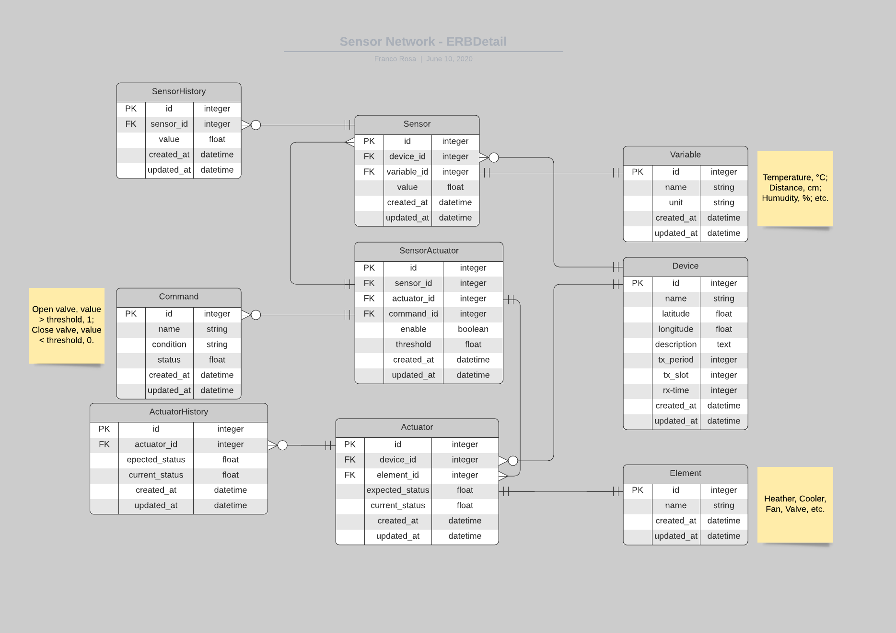

# Sensor Network

This app enables users interact with sensors and actuators deployed in a remote field

# Entity Relationship Diagram 



# Desired features

* Nice GUI

* Realtime update

* Geolocation

# API
## Read sensor value:
```
url: /api/sensors
method: get
format: json
data: {'sensor': {'id': [3, 4, 5]}} #many sensors
data: {'sensor': {'id': [3]}} #only one
data: {'sensor': {'id': []}} #all sensors 
response:
```

## Update sensor value:
```
url: /api/sensors
method: get
format: json
data: {'sensor': {'id': [3], 'value': [0]}} #one sensor
data: {'sensor': {'id': [3, 4, 5], 'value': [1.11, 2.22, 3.33 ]}} #many sensors
response:
```

## Read actuator value:
```
url: /api/actuators
method: get
format: json
data: {'actuator': {'id': [1, 2, 3]}} #many actuators
data: {'actuator': {'id': [3]}} #only one
data: {'actuator': {'id': []}} #all sensors
response:
```

## Update actuator value
```
url: /api/actuators
method: get
format: json
data: {'actuator': {'id': [3], 'expected_status': [0]}} #one actuator
data: {'actuator': {'id': [1,2,3], 'expected_status': [9.99, 10.11, 11.22 ]}} #many actuators
response: [[10, 23.0], [11, 25.0]]
```

## Read change token, when this value changes is because there is an update on any actuator, instead of making SQL queries all te time
```
url: /api/actuators
method: get
format: json
data: {}
response: {'token': 10} # 10 is the current value of the token
```
