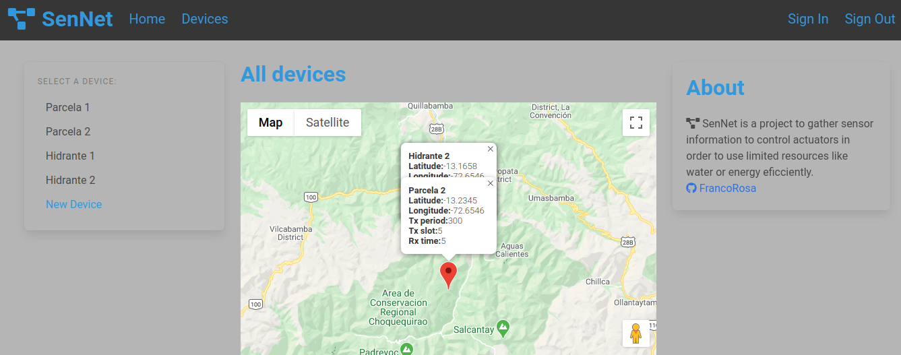
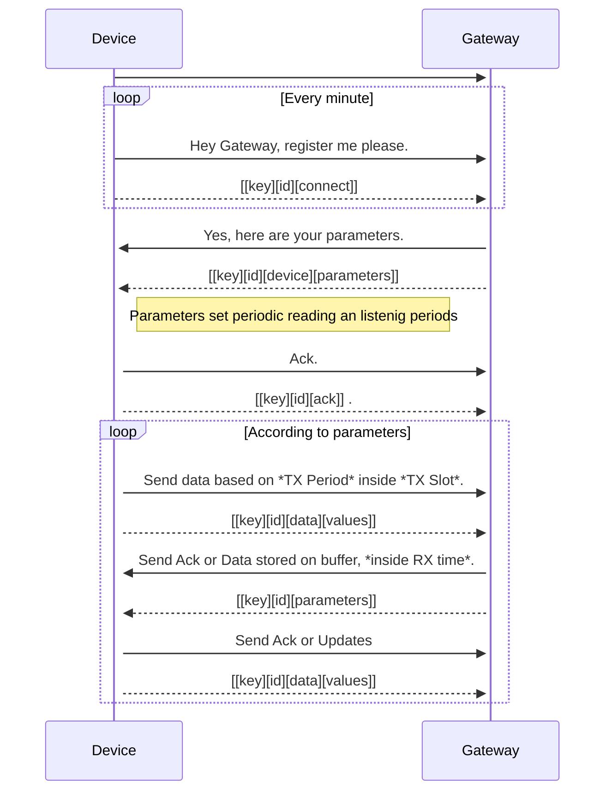

# Sensor Network

This app enables users interact with sensors and actuators deployed in a remote field


# Entity Relationship Diagram 


# Future improvements

* Improve UI

* Realtime update instead of using a token

# How to use it

* Follow this link [SensorNetwork](https://sensor-network-lora.herokuapp.com)

# API

Use *get* requests in *json* format to upload data and read sensors from other apps 

## Read sensor value:
```
url: /api/sensors
method: get
format: json
data: {'sensor': {'id': [3, 4, 5]}} #many sensors
data: {'sensor': {'id': [3]}} #only one
data: {'sensor': {'id': []}} #all sensors 
response:
```

## Update sensor value:
```
url: /api/sensors
method: get
format: json
data: {'sensor': {'id': [3], 'value': [0]}} #one sensor
data: {'sensor': {'id': [3, 4, 5], 'value': [1.11, 2.22, 3.33 ]}} #many sensors
response:
```

## Read actuator value:
```
url: /api/actuators
method: get
format: json
data: {'actuator': {'id': [1, 2, 3]}} #many actuators
data: {'actuator': {'id': [3]}} #only one
data: {'actuator': {'id': []}} #all sensors
response:
```

## Update actuator value
```
url: /api/actuators
method: get
format: json
data: {'actuator': {'id': [3], 'expected_status': [0]}} #one actuator
data: {'actuator': {'id': [1,2,3], 'expected_status': [9.99, 10.11, 11.22 ]}} #many actuators
response: [[10, 23.0], [11, 25.0]]
```

## Read change token
When this value changes is because there is an update on any actuator, instead of making SQL queries frequently.
```
url: /api/actuators
method: get
format: json
data: {}
response: {'token': 10} # 10 is the current value of the token
```
# Gateway
A gateway is a device that can interface other devices with this web app. For instance, devices that can not work directly with the API.

## LoRa Gateway
To make LoRa devices interact with the app we are following the sequence stated bellow. *Key is a _secret_ common value shared between the device and gateway

### Gateway tasks:
* Read all transmissions (Loop)
* If register frame is received, register device, send configuration parameters
* If monitoring frame is received, update readings, send commands stored on outbox
* Look for changes on actuator or config, if new changes, then put them on the outbox pile
* Gateway should send logging data to web app. For instance, when it started to work, etc.